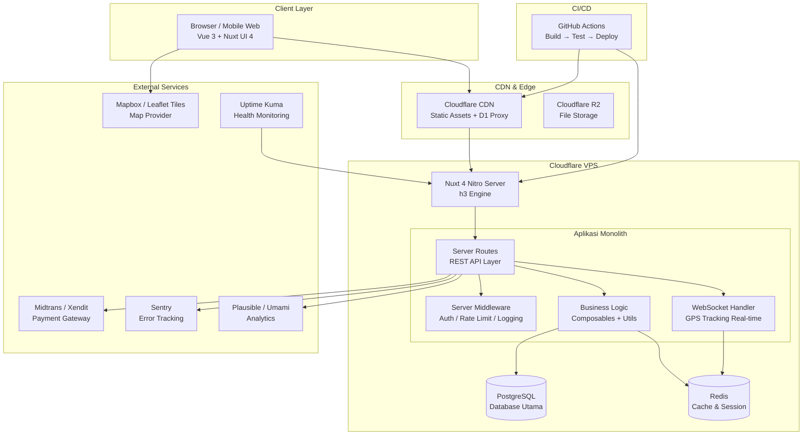
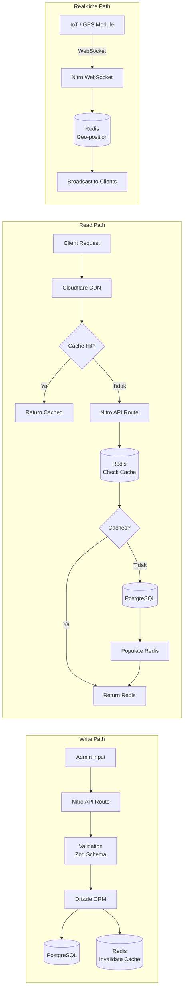
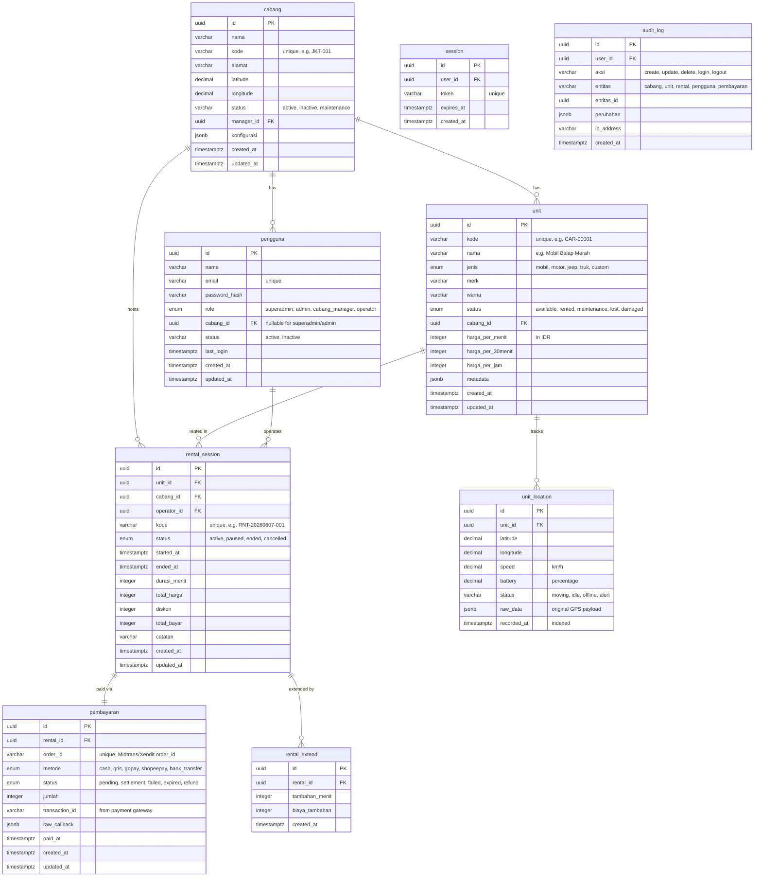
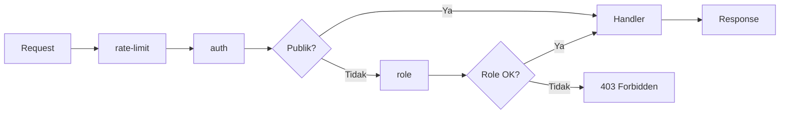
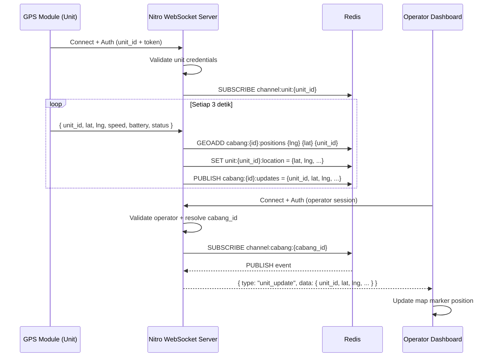
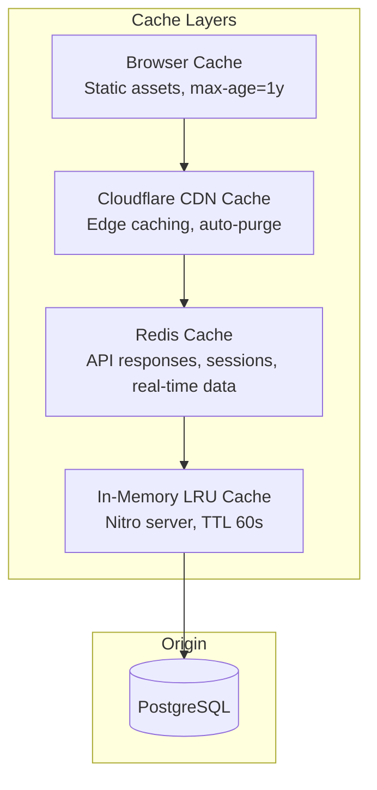
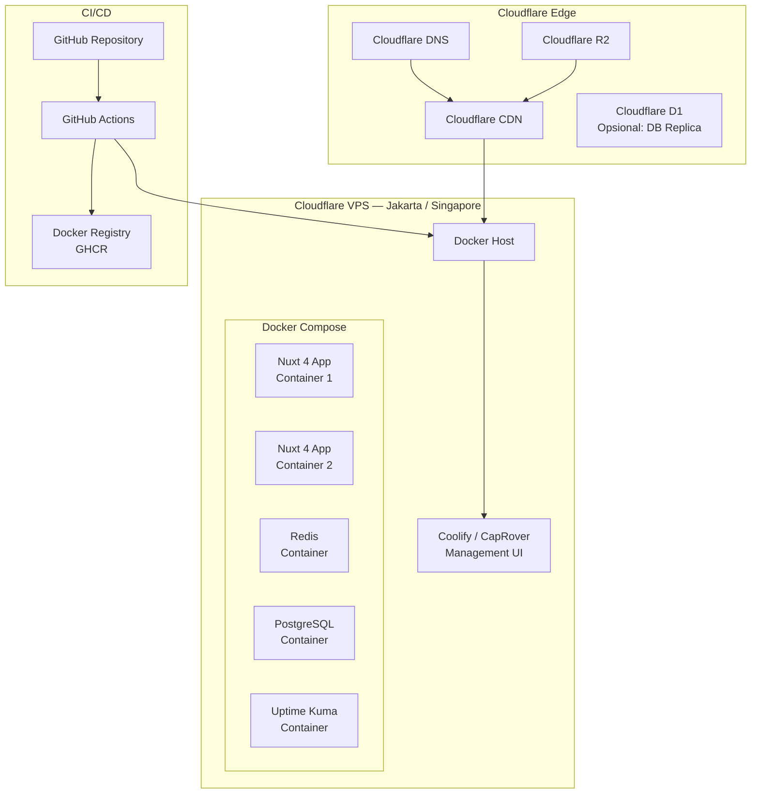
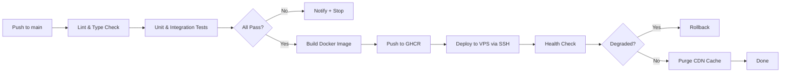
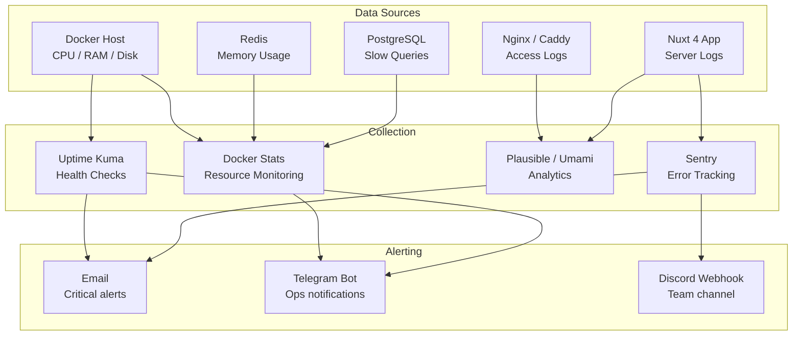

# Technical Blueprint — Aplikasi Tracking Mobil-Mobilan Rental Anak

> **Versi:** 1.0.0
> **Tanggal:** 2026-06-07
> **Penulis:** Lead Software Architect
> **Target Deploy:** Cloudflare VPS

---

## Daftar Isi

1. [Ikhtisar Sistem](#1-ikhtisar-sistem)
2. [System Architecture Overview](#2-system-architecture-overview)
3. [Architecture Style: Monolith Nuxt 4 + Nitro](#3-architecture-style-monolith-nuxt-4--nitro)
4. [Component Architecture](#4-component-architecture)
5. [Data Architecture](#5-data-architecture)
6. [API Architecture](#6-api-architecture)
7. [Authentication & Authorization](#7-authentication--authorization)
8. [Real-time Tracking Architecture](#8-real-time-tracking-architecture)
9. [Caching Strategy](#9-caching-strategy)
10. [File Storage](#10-file-storage)
11. [Deployment Architecture](#11-deployment-architecture)
12. [Monitoring & Observability](#12-monitoring--observability)
13. [Scalability Considerations](#13-scalability-considerations)
14. [Security Architecture](#14-security-architecture)

---

## 1. Ikhtisar Sistem

Aplikasi **tracking mobil-mobilan rental anak** adalah sistem full-stack berbasis Nuxt 4 yang melayani operasional 250 cabang pop-up store dengan total 40.000 unit mobil-mobilan di seluruh Indonesia. Sistem mencakup manajemen inventaris unit, pelacakan posisi real-time (GPS), manajemen rental/sesi bermain, pembayaran digital, serta dashboard analitik untuk pemilik cabang dan manajemen pusat.

### Metrik Skala

| Parameter | Nilai |
|-----------|-------|
| Jumlah Cabang | 250 (pop-up store) |
| Total Unit | 40.000 mobil-mobilan |
| Rata-rata Unit per Cabang | 160 unit |
| Pengguna Aktif Harian (estimasi) | ~5.000 |
| Target Latency API | < 200ms p95 |
| Target Throughput | 2.000 req/s |

---

## 2. System Architecture Overview

### Diagram Arsitektur Tingkat Tinggi



### Diagram Alur Data



---

## 3. Architecture Style: Monolith Nuxt 4 + Nitro

### Keputusan Arsitektur

Aplikasi menggunakan arsitektur **monolith full-stack** dengan Nuxt 4 dan Nitro server, bukan microservices. Keputusan ini diambil dengan pertimbangan:

| Faktor | Monolith Nuxt 4 | Microservices |
|--------|----------------|---------------|
| Kompleksitas Tim | Sesuai untuk tim kecil-menengah (3-8 dev) | Butuh tim besar + DevOps dedicated |
| Waktu Pengembangan | Cepat, satu codebase | Lambat, overhead koordinasi |
| Deploy | Satu unit deploy via Docker | Multi-service orchestration (K8s) |
| Debugging | Sederhana, satu runtime | Kompleks, distributed tracing |
| Skala Target | 250 cabang, 5K DAU — monolith cukup | Butuh di atas ~50K DAU |
| Biaya Infra | 1-2 VPS | Minimal 3-5 node |

**Kesimpulan:** Monolith Nuxt 4 dipilih karena menyediakan full-stack capability dalam satu codebase (Vue frontend + Nitro backend), mengurangi overhead operasional, dan cukup untuk skala yang ditargetkan. Arsitektur dapat dievolusi ke modular monolith atau microservices di masa depan jika skala membesar.

### Struktur Direktori

```
app/
├── assets/
│   ├── css/
│   │   └── main.css           # Tailwind CSS v4 entry
│   └── images/                # Static images (logo, icons)
├── components/
│   ├── common/                # Shared UI components
│   │   ├── DataTable.vue
│   │   ├── StatusBadge.vue
│   │   └── MapView.vue
│   ├── tracking/              # Tracking-specific
│   │   ├── UnitTracker.vue
│   │   ├── LiveMap.vue
│   │   └── UnitStatusCard.vue
│   ├── rental/                # Rental flow
│   │   ├── RentalForm.vue
│   │   ├── SessionTimer.vue
│   │   └── PaymentModal.vue
│   ├── cabang/                # Branch management
│   │   ├── BranchDashboard.vue
│   │   ├── InventoryList.vue
│   │   └── ShiftReport.vue
│   └── admin/                 # Central admin
│       ├── BranchTable.vue
│       ├── RevenueChart.vue
│       └── SystemHealth.vue
├── composables/
│   ├── useAuth.ts             # Auth state & methods
│   ├── useTracking.ts         # WebSocket real-time tracking
│   ├── useRental.ts           # Rental session logic
│   ├── usePayment.ts          # Payment gateway integration
│   ├── useGeolocation.ts      # Map & geolocation helpers
│   └── useApi.ts              # $fetch wrapper with interceptors
├── layouts/
│   ├── default.vue            # Public layout
│   ├── admin.vue              # Admin dashboard layout
│   └── cabang.vue             # Branch operator layout
├── middleware/
│   ├── auth.global.ts         # Global auth check
│   ├── admin.ts               # Role: superadmin, admin
│   └── cabang.ts              # Role: cabang_manager, operator
├── pages/
│   ├── index.vue              # Landing / login
│   ├── login.vue              # Login page
│   ├── admin/
│   │   ├── index.vue          # Admin dashboard
│   │   ├── cabang.vue         # Branch CRUD
│   │   ├── unit.vue           # Global unit inventory
│   │   ├── laporan.vue        # Reports
│   │   └── pengguna.vue       # User management
│   └── cabang/
│       ├── index.vue          # Branch dashboard
│       ├── unit.vue           # Branch unit inventory
│       ├── rental.vue         # Active rentals
│       ├── tracking.vue       # Live tracking map
│       └── laporan.vue        # Branch reports
├── plugins/
│   ├── nuxt-ui.ts             # Nuxt UI plugin
│   ├── pinia.ts               # Pinia store
│   ├── vue-leaflet.ts         # Leaflet map client plugin
│   └── sentry.ts              # Sentry client
├── utils/
│   ├── formatters.ts          # Currency, date formatters
│   ├── validators.ts          # Zod schemas (shared)
│   └── constants.ts           # Enums, status codes
server/
├── api/
│   ├── auth/
│   │   ├── login.post.ts      # POST /api/auth/login
│   │   ├── register.post.ts   # POST /api/auth/register
│   │   └── session.get.ts     # GET  /api/auth/session
│   ├── cabang/
│   │   ├── index.get.ts       # GET  /api/cabang (list)
│   │   ├── [id].get.ts        # GET  /api/cabang/:id
│   │   ├── [id].put.ts        # PUT  /api/cabang/:id
│   │   ├── create.post.ts     # POST /api/cabang
│   │   └── [id].delete.ts     # DEL  /api/cabang/:id
│   ├── unit/
│   │   ├── index.get.ts       # GET  /api/unit (list + filter)
│   │   ├── [id].get.ts        # GET  /api/unit/:id
│   │   ├── [id].put.ts        # PUT  /api/unit/:id
│   │   ├── create.post.ts     # POST /api/unit
│   │   ├── [id].location.get.ts  # GET last known location
│   │   └── [id].history.get.ts   # GET location history
│   ├── rental/
│   │   ├── index.get.ts       # GET  /api/rental (list)
│   │   ├── [id].get.ts        # GET  /api/rental/:id
│   │   ├── start.post.ts      # POST /api/rental/start
│   │   ├── [id]/end.post.ts   # POST /api/rental/:id/end
│   │   └── [id]/extend.post.ts # POST /api/rental/:id/extend
│   ├── payment/
│   │   ├── create.post.ts     # POST /api/payment/create
│   │   ├── callback.post.ts   # POST /api/payment/callback (webhook)
│   │   └── [id]/status.get.ts # GET  /api/payment/:id/status
│   ├── tracking/
│   │   ├── active.get.ts      # GET  /api/tracking/active
│   │   └── websocket.ts       # WebSocket upgrade handler
│   ├── laporan/
│   │   ├── pendapatan.get.ts  # GET  /api/laporan/pendapatan
│   │   ├── unit.get.ts        # GET  /api/laporan/unit
│   │   └── cabang.get.ts      # GET  /api/laporan/cabang
│   └── dashboard/
│       ├── admin.get.ts       # GET  /api/dashboard/admin
│       └── cabang.get.ts      # GET  /api/dashboard/cabang
├── middleware/
│   ├── auth.ts                # Server-side auth verification
│   ├── role.ts                # Role-based access guard
│   └── rate-limit.ts          # Rate limiting (per IP / per user)
├── utils/
│   ├── db.ts                  # Drizzle ORM + DB connection
│   ├── cache.ts               # Redis helpers
│   ├── r2.ts                  # Cloudflare R2 client
│   ├── payment.ts             # Midtrans/Xendit SDK wrapper
│   └── websocket.ts           # WebSocket hub manager
shared/
├── types/
│   ├── user.ts                # User, Role enums
│   ├── cabang.ts              # Cabang, PopUpStore types
│   ├── unit.ts                # Unit, UnitStatus, UnitType
│   ├── rental.ts              # RentalSession, RentalStatus
│   ├── payment.ts             # Payment, PaymentStatus
│   └── tracking.ts            # GPSPosition, TrackingEvent
└── constants/
    ├── status.ts              # Shared status enums
    └── config.ts              # App-wide config constants
public/
├── favicon.ico
└── robots.txt
```

---

## 4. Component Architecture

### Layer Arsitektur

```
┌─────────────────────────────────────────────────────┐
│                   PRESENTATION LAYER                 │
│  Pages → Layouts → Components (Vue SFC)             │
│  Nuxt UI 4 + Tailwind CSS v4                        │
├─────────────────────────────────────────────────────┤
│                   COMPOSITION LAYER                  │
│  Composables (useAuth, useTracking, useRental, …)   │
│  Pinia Stores → Shared State                        │
├─────────────────────────────────────────────────────┤
│                   SERVICE LAYER                      │
│  Server Routes → Business Logic                     │
│  Server Utils (db, cache, payment, websocket)       │
├─────────────────────────────────────────────────────┤
│                   DATA LAYER                         │
│  Drizzle ORM → PostgreSQL / D1                      │
│  Redis Cache Layer                                  │
│  Cloudflare R2 (File Storage)                       │
└─────────────────────────────────────────────────────┘
```

### Deskripsi Setiap Layer

#### Presentation Layer (Vue SFC)

| Komponen | Tanggung Jawab |
|----------|---------------|
| `pages/` | File-based routing Nuxt. Setiap file `.vue` mewakili satu rute. Halaman admin dan cabang dipisahkan untuk isolasi akses. |
| `layouts/` | Tiga layout: `default` (login/landing), `admin` (sidebar admin + topbar), `cabang` (sidebar operator cabang). |
| `components/` | Vue 3 SFC dengan `<script setup>`. Komponen dikelompokkan per domain: `common`, `tracking`, `rental`, `cabang`, `admin`. |
| Nuxt UI 4 | Komponen UI siap pakai: `UButton`, `UModal`, `UTable`, `UInput`, `USelect`, `UCard`, `UBadge`, `UAlert`, dsb. Mempercepat development. |
| Tailwind CSS v4 | Utility-first styling. Konfigurasi tema terpusat di `tailwind.config.ts`. |

#### Composition Layer

| Composable / Store | Tanggung Jawab |
|-------------------|---------------|
| `useAuth` | Manajemen state autentikasi: login, logout, session refresh, role check. |
| `useApi` | Wrapper `$fetch` dengan interceptor: auto-attach token, auto-refresh, error toast. |
| `useTracking` | Koneksi WebSocket untuk live tracking. Buffer posisi, reconnect logic, event emitter. |
| `useRental` | Logika rental: start session, kalkulasi biaya, extend, end session. |
| `usePayment` | Integrasi payment gateway: create transaction, handle callback, status polling. |
| `useGeolocation` | Helper untuk Leaflet/Mapbox: render marker, fit bounds, geocode. |
| Pinia Stores | `useBranchStore`, `useUnitStore`, `useRentalStore`, `useAuthStore` — state manajemen global. |

#### Service Layer (Nitro Server)

| Server Utility | Tanggung Jawab |
|---------------|---------------|
| `db.ts` | Inisialisasi Drizzle ORM dengan koneksi PostgreSQL. Export `db` instance. |
| `cache.ts` | Redis client: `get`, `set`, `del`, `invalidatePattern`. Cache TTL default 5 menit. |
| `r2.ts` | Cloudflare R2 client via S3-compatible API. Upload, signed URL generation. |
| `payment.ts` | Midtrans/Xendit SDK wrapper: create Snap token, verify signature, handle notification. |
| `websocket.ts` | WebSocket hub: manage koneksi, subscribe channel per cabang, broadcast posisi unit. |

#### Data Layer

Lihat [Section 5: Data Architecture](#5-data-architecture).

---

## 5. Data Architecture

### Database Selection: PostgreSQL via `nuxt-hub` / D1 Compatibility Layer

PostgreSQL dipilih sebagai database utama karena:
- **Relational integrity** untuk data transaksional (rental, pembayaran, inventaris)
- **PostGIS extension** untuk operasi geospasial (tracking posisi, radius pencarian)
- **Row-Level Security (RLS)** untuk isolasi data per cabang
- **JSONB support** untuk metadata fleksibel pada unit dan rental

### Entity-Relationship Diagram



### Indeks yang Direkomendasikan

| Tabel | Indeks | Tipe | Alasan |
|-------|--------|------|--------|
| `unit_location` | `(unit_id, recorded_at DESC)` | B-tree | Query history lokasi per unit |
| `unit_location` | `(recorded_at)` | BRIN | Range scan waktu untuk cleanup |
| `unit_location` | `(latitude, longitude)` | GiST (PostGIS) | Spatial query radius |
| `rental_session` | `(cabang_id, status)` | B-tree | Filter rental aktif per cabang |
| `rental_session` | `(unit_id, status)` | B-tree | Cek ketersediaan unit |
| `unit` | `(cabang_id, status)` | B-tree | Inventaris per cabang |
| `pembayaran` | `(status, created_at)` | B-tree | Rekonsiliasi pembayaran |
| `audit_log` | `(entitas, entitas_id)` | B-tree | Audit trail lookup |

### Strategi Partisi

Untuk tabel `unit_location` yang tumbuh paling cepat:

```sql
-- Partisi per bulan berdasarkan recorded_at
CREATE TABLE unit_location (
    id UUID DEFAULT gen_random_uuid(),
    unit_id UUID NOT NULL,
    latitude DOUBLE PRECISION NOT NULL,
    longitude DOUBLE PRECISION NOT NULL,
    speed DOUBLE PRECISION,
    battery DOUBLE PRECISION,
    status VARCHAR(20),
    raw_data JSONB,
    recorded_at TIMESTAMPTZ NOT NULL DEFAULT NOW()
) PARTITION BY RANGE (recorded_at);

-- Partisi bulanan
CREATE TABLE unit_location_2026_06 PARTITION OF unit_location
    FOR VALUES FROM ('2026-06-01') TO ('2026-07-01');
```

### Retensi Data

| Data | Retensi | Strategi |
|------|---------|----------|
| `unit_location` | 90 hari | Partisi bulanan, auto-drop partisi lama via cron |
| `rental_session` | 2 tahun | Archive ke tabel `rental_session_archive` via cron |
| `audit_log` | 1 tahun | Archive atau truncate via cron |
| `session` | 7 hari | Auto-expire via TTL kolom `expires_at` |

### Redis — Struktur Data Cache

| Key Pattern | Tipe | TTL | Deskripsi |
|------------|------|-----|-----------|
| `session:{token}` | String (JSON) | 24h | Session data user |
| `unit:{id}:location` | String (JSON) | Real-time | Posisi terakhir unit |
| `unit:{id}:status` | String | 5m | Status unit (cache) |
| `cabang:{id}:units:active` | Set | Real-time | Set ID unit aktif di cabang |
| `cabang:{id}:stats` | String (JSON) | 1m | Statistik real-time cabang |
| `rate_limit:{ip}:{endpoint}` | String (counter) | 1m window | Rate limiting counter |
| `dashboard:admin` | String (JSON) | 1m | Cache dashboard admin |
| `list:unit:cabang:{id}` | String (JSON) | 5m | Cache list unit per cabang |

---

## 6. API Architecture

### REST API Design

Semua endpoint berada di bawah prefix `/api/`. Nitro server menangani route via file-based routing di `server/api/`.

#### Konvensi

| Aspek | Konvensi |
|-------|----------|
| Base URL | `https://<domain>/api/` |
| Format | JSON request/response |
| Versioning | URL prefix `/api/v1/` (opsional via Nitro route prefix) |
| HTTP Methods | GET (read), POST (create), PUT (update), DELETE (delete) |
| Status Codes | 200, 201, 204, 400, 401, 403, 404, 422, 429, 500 |
| Pagination | `?page=1&limit=20` + `X-Total-Count` header |
| Filtering | `?status=active&cabang_id=xxx` |
| Sorting | `?sort=created_at&order=desc` |
| Search | `?q=keyword` untuk full-text search |

#### Struktur Response Standar

```json
{
  "success": true,
  "data": { ... },
  "meta": {
    "page": 1,
    "limit": 20,
    "total": 250,
    "total_pages": 13
  }
}
```

#### Struktur Error Response

```json
{
  "success": false,
  "error": {
    "code": "VALIDATION_ERROR",
    "message": "Field 'nama' wajib diisi",
    "details": [
      { "field": "nama", "message": "Required" }
    ]
  }
}
```

### Daftar Endpoint API

#### Authentication
| Method | Endpoint | Auth | Deskripsi |
|--------|----------|------|-----------|
| POST | `/api/auth/login` | No | Login user, return session token |
| POST | `/api/auth/register` | Admin | Register pengguna baru |
| POST | `/api/auth/logout` | Yes | Invalidate session |
| GET | `/api/auth/session` | Yes | Get current session info |

#### Cabang
| Method | Endpoint | Auth | Deskripsi |
|--------|----------|------|-----------|
| GET | `/api/cabang` | Admin | List semua cabang (paginated) |
| GET | `/api/cabang/:id` | Admin/Cabang | Detail cabang |
| POST | `/api/cabang` | Admin | Buat cabang baru |
| PUT | `/api/cabang/:id` | Admin | Update cabang |
| DELETE | `/api/cabang/:id` | Admin | Hapus cabang (soft delete) |

#### Unit
| Method | Endpoint | Auth | Deskripsi |
|--------|----------|------|-----------|
| GET | `/api/unit` | Admin/Cabang | List unit (filter by cabang_id, status) |
| GET | `/api/unit/:id` | Admin/Cabang | Detail unit |
| POST | `/api/unit` | Admin/Cabang | Tambah unit baru |
| PUT | `/api/unit/:id` | Admin/Cabang | Update unit |
| GET | `/api/unit/:id/location` | Admin/Cabang | Lokasi terakhir unit |
| GET | `/api/unit/:id/history` | Admin/Cabang | Riwayat lokasi unit |

#### Rental
| Method | Endpoint | Auth | Deskripsi |
|--------|----------|------|-----------|
| GET | `/api/rental` | Admin/Cabang | List rental (filter) |
| GET | `/api/rental/:id` | Admin/Cabang | Detail rental |
| POST | `/api/rental/start` | Cabang | Mulai sesi rental |
| POST | `/api/rental/:id/end` | Cabang | Akhiri sesi rental |
| POST | `/api/rental/:id/extend` | Cabang | Perpanjang sesi rental |

#### Pembayaran
| Method | Endpoint | Auth | Deskripsi |
|--------|----------|------|-----------|
| POST | `/api/payment/create` | Cabang | Buat transaksi pembayaran |
| POST | `/api/payment/callback` | No (HMAC) | Webhook callback payment gateway |
| GET | `/api/payment/:id/status` | Cabang | Cek status pembayaran |

#### Tracking
| Method | Endpoint | Auth | Deskripsi |
|--------|----------|------|-----------|
| GET | `/api/tracking/active` | Cabang | List unit yang sedang aktif dilacak |
| WS | `/api/tracking/ws` | Yes | WebSocket untuk real-time tracking |

#### Laporan & Dashboard
| Method | Endpoint | Auth | Deskripsi |
|--------|----------|------|-----------|
| GET | `/api/laporan/pendapatan` | Admin/Cabang | Laporan pendapatan (filter by range) |
| GET | `/api/laporan/unit` | Admin/Cabang | Laporan utilisasi unit |
| GET | `/api/laporan/cabang` | Admin | Laporan performa cabang |
| GET | `/api/dashboard/admin` | Admin | Dashboard admin pusat |
| GET | `/api/dashboard/cabang` | Cabang | Dashboard cabang |

### Server Middleware Pipeline



---

## 7. Authentication & Authorization

### Flow Autentikasi

```mermaid
sequenceDiagram
    participant U as User
    participant C as Client (Vue)
    participant N as Nitro Server
    participant D as PostgreSQL
    participant R as Redis

    U->>C: Submit email + password
    C->>N: POST /api/auth/login
    N->>D: SELECT user WHERE email = ?
    D-->>N: User row (with password_hash)
    N->>N: Verify bcrypt hash
    alt Invalid
        N-->>C: 401 Unauthorized
    else Valid
        N->>N: Generate session token (crypto.randomUUID)
        N->>D: INSERT INTO session (user_id, token, expires_at)
        N->>R: SET session:{token} = user_session_data (TTL 24h)
        N-->>C: Set-Cookie: nuxt-session={token}; HttpOnly; Secure; SameSite=Lax
        C-->>U: Redirect to dashboard
    end
```

### Role-Based Access Control (RBAC)

| Role | Akses | Deskripsi |
|------|-------|-----------|
| `superadmin` | Semua | Akses penuh: kelola admin, semua cabang, semua data, konfigurasi sistem |
| `admin` | Pusat (tanpa superadmin) | Kelola cabang, unit, pengguna, lihat laporan semua cabang |
| `cabang_manager` | Dalam cabang sendiri | Kelola unit cabang, rental, operator, laporan cabang |
| `operator` | Terbatas cabang sendiri | Operasional rental: start/end session, pembayaran, tracking |

### Implementasi Middleware

**Server Middleware (`server/middleware/auth.ts`):**
1. Ekstrak token dari cookie `nuxt-session` atau header `Authorization: Bearer <token>`
2. Validasi token terhadap Redis (`session:{token}`) → jika tidak ada, cek PostgreSQL
3. Attach `event.context.user = { id, role, cabang_id }` untuk digunakan di handler
4. Jika tidak valid → return 401

**Server Middleware (`server/middleware/role.ts`):**
1. Baca `event.context.user.role`
2. Cocokkan dengan required roles yang didefinisikan di route handler (via meta / config)
3. Role `cabang_manager` dan `operator` hanya bisa mengakses data `cabang_id` sendiri
4. Enforce di query level: `WHERE cabang_id = $user.cabang_id`

**Client Middleware (`app/middleware/auth.global.ts`):**
1. Cek session via `GET /api/auth/session`
2. Jika tidak ada session → redirect ke `/login`
3. Role-based redirect: admin ke `/admin`, cabang ke `/cabang`

### Keamanan Session

| Aspek | Implementasi |
|-------|-------------|
| Token Format | UUID v4, 128-bit random |
| Penyimpanan | HttpOnly + Secure cookie, fallback ke Authorization header |
| Expiry | 24 jam, sliding expiration (refresh tiap aktivitas) |
| Invalidation | Hapus dari Redis + soft-delete dari PostgreSQL |
| CSRF | SameSite=Lax cookie + custom CSRF token untuk mutation request |
| Brute Force | Rate limiting pada `/api/auth/login` (5 attempts / 15 menit / IP) |

---

## 8. Real-time Tracking Architecture

### Overview

Sistem tracking real-time memungkinkan operator cabang melihat posisi semua unit mobil-mobilan yang sedang disewa di peta secara live. Arsitektur menggunakan **WebSocket** sebagai protokol utama karena kebutuhan latency rendah dan komunikasi dua arah.



### Protokol WebSocket

**Koneksi Endpoint:** `wss://<domain>/api/tracking/ws`

**Autentikasi:** Token session dikirim sebagai query parameter saat handshake:
```
wss://domain/api/tracking/ws?token=<session_token>
```

**Format Pesan (JSON):**

```typescript
// Client → Server (subscribe ke cabang)
{
  "type": "subscribe",
  "channel": "cabang:JKT-001"
}

// Server → Client (update posisi unit)
{
  "type": "unit_update",
  "data": {
    "unit_id": "uuid",
    "kode": "CAR-00042",
    "latitude": -6.2088,
    "longitude": 106.8456,
    "speed": 2.3,
    "battery": 85,
    "status": "moving",
    "recorded_at": "2026-06-07T10:30:00+07:00"
  }
}

// Server → Client (unit status change)
{
  "type": "unit_status",
  "data": {
    "unit_id": "uuid",
    "kode": "CAR-00042",
    "status": "idle",
    "rental_id": "uuid",
    "recorded_at": "2026-06-07T10:35:00+07:00"
  }
}

// Server → Client (alert)
{
  "type": "alert",
  "data": {
    "unit_id": "uuid",
    "kode": "CAR-00042",
    "level": "warning",
    "message": "Unit keluar dari area cabang",
    "recorded_at": "2026-06-07T10:36:00+07:00"
  }
}
```

### Geofencing (Alert Area)

Setiap cabang memiliki radius geofence default 500 meter. Jika unit bergerak di luar radius, sistem membangkitkan alert:

```typescript
// server/utils/geofence.ts
export async function checkGeofence(unitId: string, lat: number, lng: number) {
  const cabang = await getCabangByUnit(unitId);
  const distance = haversineDistance(
    { lat: cabang.latitude, lng: cabang.longitude },
    { lat, lng }
  );
  if (distance > cabang.konfigurasi.geofence_radius_meter) {
    await createAlert({ unitId, type: 'geofence_breach', distance });
    await publishWebSocket(`cabang:${cabang.kode}`, {
      type: 'alert',
      data: { unit_id: unitId, level: 'warning', message: 'Unit keluar area' }
    });
  }
}
```

### Skalabilitas WebSocket

| Strategi | Deskripsi |
|----------|-----------|
| Redis Pub/Sub | Multi-instance Nitro — Redis sebagai message broker antar instance |
| Connection Pooling | Maksimal 100 koneksi per instance Nitro |
| Heartbeat | Ping/Pong setiap 30 detik, disconnect setelah 60 detik tanpa respons |
| Backpressure | Jika Redis full, throttle publish ke 1 event/detik per unit |
| Horizontal Scaling | Tambah instance Nitro di balik load balancer (Cloudflare), Redis sebagai shared state |

### Fallback: SSE (Server-Sent Events)

Jika WebSocket tidak tersedia (firewall, proxy), client fallback ke SSE:

```
GET /api/tracking/sse?token=<session_token>
```

Event stream satu arah (server → client), cocok untuk read-only tracking.

---

## 9. Caching Strategy

### Arsitektur Cache Multi-level



### Strategi Cache per Tipe Data

| Tipe Data | Browser | CDN | Redis | TTL | Invalidation |
|-----------|---------|-----|-------|-----|--------------|
| **Static Assets** (CSS, JS, images) | ✅ 1y | ✅ 1y | ❌ | 1 tahun | Content hash di filename |
| **API: List Unit per Cabang** | ❌ | ❌ | ✅ | 5 menit | Invalidate on unit CRUD |
| **API: Dashboard Stats** | ❌ | ❌ | ✅ | 1 menit | Time-based expire |
| **API: Cabang Detail** | ❌ | ❌ | ✅ | 10 menit | Invalidate on update |
| **API: Laporan** | ❌ | ❌ | ❌ | — | Selalu fresh dari DB |
| **Session Data** | ❌ | ❌ | ✅ | 24 jam | Invalidate on logout |
| **Unit Location (latest)** | ❌ | ❌ | ✅ | Real-time | Overwrite on new position |
| **Rate Limit Counter** | ❌ | ❌ | ✅ | 1 menit | Auto-expire |
| **Payment Status** | ❌ | ❌ | ✅ | 30 detik | Invalidate on callback |

### Cache Invalidation Pattern

```
┌──────────────────────────────────────┐
│           CACHE INVALIDATION          │
├──────────────────────────────────────┤
│                                      │
│  Write Operation (CRUD)              │
│       │                              │
│       ▼                              │
│  Update PostgreSQL                   │
│       │                              │
│       ▼                              │
│  Invalidate Related Redis Keys       │
│  ┌─────────────────────────────┐    │
│  │ Pattern-based:              │    │
│  │ list:unit:cabang:*          │    │
│  │ dashboard:*                 │    │
│  │ cabang:*:stats              │    │
│  └─────────────────────────────┘    │
│       │                              │
│       ▼                              │
│  (Optional) Purge Cloudflare Cache   │
│  via API: zone-purge by URL prefix  │
│                                      │
└──────────────────────────────────────┘
```

### Implementasi Redis di Nitro

```typescript
// server/utils/cache.ts
import { createClient } from 'redis';

const redis = createClient({
  url: process.env.REDIS_URL,
  socket: { reconnectStrategy: 5000 }
});

await redis.connect();

export async function cacheGet<T>(key: string): Promise<T | null> {
  const raw = await redis.get(key);
  return raw ? JSON.parse(raw) : null;
}

export async function cacheSet(key: string, data: unknown, ttlSeconds = 300): Promise<void> {
  await redis.set(key, JSON.stringify(data), { EX: ttlSeconds });
}

export async function cacheInvalidate(pattern: string): Promise<void> {
  const keys = await redis.keys(pattern);
  if (keys.length > 0) {
    await redis.del(keys);
  }
}
```

---

## 10. File Storage

### Cloudflare R2

Cloudflare R2 dipilih sebagai penyimpanan objek (object storage) karena:

| Faktor | Cloudflare R2 | AWS S3 | Google Cloud Storage |
|--------|--------------|--------|---------------------|
| Biaya Egress | **$0 (gratis)** | $0.09/GB | $0.12/GB |
| Storage Cost | $0.015/GB/bulan | $0.023/GB/bulan | $0.020/GB/bulan |
| Integrasi CF | Native dengan CDN, Workers, D1 | Perlu setup terpisah | Perlu setup terpisah |
| S3 API | ✅ Compatible | ✅ Native | ✅ Compatible |

### Jenis Aset yang Disimpan

| Jenis Aset | Prefix | Akses | Ukuran Maks |
|-----------|--------|-------|-------------|
| Foto Unit | `units/{unit_id}/` | Public (CDN) | 5 MB |
| Foto Cabang | `cabangs/{cabang_id}/` | Public (CDN) | 5 MB |
| Logo Cabang | `cabangs/{cabang_id}/logo/` | Public (CDN) | 2 MB |
| Laporan Export | `exports/{date}/` | Private (signed URL) | 50 MB |
| Backup Database | `backups/{date}/` | Private (admin only) | 500 MB |
| Bukti Pembayaran | `payments/{payment_id}/` | Private (signed URL) | 3 MB |

### Implementasi R2 Client

```typescript
// server/utils/r2.ts
import { S3Client, PutObjectCommand, GetObjectCommand } from '@aws-sdk/client-s3';
import { getSignedUrl } from '@aws-sdk/s3-request-presigner';

const r2 = new S3Client({
  region: 'auto',
  endpoint: `https://${process.env.CF_ACCOUNT_ID}.r2.cloudflarestorage.com`,
  credentials: {
    accessKeyId: process.env.R2_ACCESS_KEY_ID!,
    secretAccessKey: process.env.R2_SECRET_ACCESS_KEY!,
  },
});

export async function uploadFile(key: string, body: Buffer, contentType: string): Promise<string> {
  await r2.send(new PutObjectCommand({
    Bucket: process.env.R2_BUCKET!,
    Key: key,
    Body: body,
    ContentType: contentType,
    CacheControl: 'public, max-age=31536000, immutable',
  }));
  return `${process.env.R2_PUBLIC_URL}/${key}`;
}

export async function getSignedFileUrl(key: string, expiresIn = 3600): Promise<string> {
  return getSignedUrl(r2, new GetObjectCommand({
    Bucket: process.env.R2_BUCKET!,
    Key: key,
  }), { expiresIn });
}
```

---

## 11. Deployment Architecture

### Infrastruktur Target



### Spesifikasi VPS

| Komponen | Spesifikasi Minimum | Rekomendasi |
|----------|-------------------|-------------|
| CPU | 4 vCPU | 8 vCPU |
| RAM | 8 GB | 16 GB |
| Storage | 100 GB SSD | 250 GB SSD |
| Bandwidth | 2 TB/bulan | 5 TB/bulan |
| OS | Ubuntu 24.04 LTS | Ubuntu 24.04 LTS |
| Provider | Cloudflare / DigitalOcean / Vultr | — |

### Docker Compose Stack

```yaml
# docker-compose.yml
version: '3.8'

services:
  app:
    image: ghcr.io/org/rental-tracking:latest
    restart: always
    ports:
      - "3000:3000"
    env_file:
      - .env.production
    depends_on:
      redis:
        condition: service_healthy
      postgres:
        condition: service_healthy
    deploy:
      replicas: 2
    healthcheck:
      test: ["CMD", "curl", "-f", "http://localhost:3000/api/health"]
      interval: 30s
      timeout: 10s
      retries: 3

  redis:
    image: redis:7-alpine
    restart: always
    volumes:
      - redis_data:/data
    command: redis-server --appendonly yes --maxmemory 512mb --maxmemory-policy allkeys-lru
    healthcheck:
      test: ["CMD", "redis-cli", "ping"]
      interval: 10s
      timeout: 5s
      retries: 3

  postgres:
    image: pgvector/pgvector:pg16
    restart: always
    environment:
      POSTGRES_DB: rental_tracking
      POSTGRES_USER: app_user
      POSTGRES_PASSWORD: ${DB_PASSWORD}
    volumes:
      - postgres_data:/var/lib/postgresql/data
      - ./init-db.sql:/docker-entrypoint-initdb.d/init.sql
    healthcheck:
      test: ["CMD-SHELL", "pg_isready -U app_user -d rental_tracking"]
      interval: 10s
      timeout: 5s
      retries: 5

volumes:
  redis_data:
  postgres_data:
```

### CI/CD Pipeline (GitHub Actions)



### Strategi Zero-Downtime Deploy

1. Build Docker image baru dengan tag `:${GITHUB_SHA}` dan `:latest`
2. Scale up container baru (2 → 4 instance)
3. Health check container baru
4. Switch traffic via Docker network alias / load balancer
5. Graceful shutdown container lama (SIGTERM → tunggu koneksi selesai → SIGKILL)
6. Scale down (4 → 2 instance)

---

## 12. Monitoring & Observability

### Stack Monitoring



### Health Check Endpoints

| Endpoint | Deskripsi | Interval |
|----------|-----------|----------|
| `GET /api/health` | App liveness: return 200 OK | 30 detik |
| `GET /api/health/ready` | Readiness: DB + Redis connectivity check | 30 detik |
| `GET /api/health/db` | Database query latency | 60 detik |
| `GET /api/health/redis` | Redis ping latency | 60 detik |

### Metrics yang Dimonitor

| Metric | Tools | Threshold Alert |
|--------|-------|----------------|
| API Response Time (p95) | Sentry Performance | > 500ms |
| API Error Rate | Sentry | > 1% |
| WebSocket Connection Count | Custom metric → Redis | > 500 per instance |
| PostgreSQL Active Connections | `pg_stat_activity` | > 80% pool max |
| Redis Memory Usage | `redis-cli INFO memory` | > 80% maxmemory |
| Disk Usage | `df -h` | > 85% |
| CPU Usage | `top` / Docker stats | > 80% sustained 5m |
| Payment Gateway Failure Rate | Custom counter | > 5% |
| Login Failure Rate (brute force) | Custom counter | > 10/menit/IP |

### Logging Strategy

| Level | Penggunaan | Retensi |
|-------|-----------|---------|
| `ERROR` | Exception, payment failure, DB connection loss | 90 hari (Sentry) |
| `WARN` | Rate limit hit, geofence alert, cache miss spike | 30 hari |
| `INFO` | Login, logout, CRUD operations, payment success | 14 hari |
| `DEBUG` | Development only | Tidak aktif di production |

---

## 13. Scalability Considerations

### Skalabilitas untuk 250 Cabang

#### Database Scaling

| Strategi | Implementasi | Target |
|----------|-------------|--------|
| Connection Pooling | PgBouncer atau built-in Drizzle pool (max 50 connections) | Hindari connection exhaustion |
| Read Replica | Cloudflare D1 / PostgreSQL read replica untuk query laporan | Pisahkan read-heavy query |
| Partisi | `unit_location` dipartisi per bulan | Query history tetap cepat |
| Vacuum | Auto-vacuum PostgreSQL, jadwal `VACUUM ANALYZE` mingguan | Bloat prevention |

#### Application Scaling

| Strategi | Implementasi |
|----------|-------------|
| Horizontal Scaling | Nitro app dijalankan dalam multiple containers (2-4 instance) |
| Load Balancing | Cloudflare Load Balancer atau Nginx reverse proxy di VPS |
| Stateless Design | Session di Redis (bukan in-memory), semua state di DB/Redis |
| WebSocket Scaling | Redis Pub/Sub sebagai message broker antar instance Nitro |
| Queue System | BullMQ (Redis-backed) untuk operasi async: export laporan, bulk notification |

#### Caching Scaling

| Strategi | Implementasi |
|----------|-------------|
| Redis Cluster | Jika single Redis mencapai batas memori → Redis Cluster 3-node |
| CDN Offload | Cloudflare CDN cache untuk static assets, kurangi beban origin |
| Cache Warming | Pre-populate cache untuk dashboard saat deploy / restart |

#### Traffic Estimation & Capacity Planning

```
Estimasi per cabang:
- 160 unit × 1 update GPS/3 detik = ~53 write/s per cabang (ke Redis)
- 2 operator × 1 query/5 detik = ~0.4 read/s per cabang (ke API)

Total 250 cabang:
- GPS writes ke Redis: ~13,250 msg/s (dengan Redis Pub/Sub)
- API reads: ~100 req/s
- API writes (rental/payment): ~10 req/s
- WebSocket connections: ~500 concurrent (2 operator per cabang)

Kapasitas minimum:
- Nitro: 2 instance × mampu handle ~500 req/s = cukup untuk ~1,000 req/s peak
- PostgreSQL: ~200 TPS dengan koneksi pooling
- Redis: ~15,000 ops/s (jauh di bawah limit Redis ~100,000 ops/s)
```

### Rencana Scaling Masa Depan

| Skala | Arsitektur | Infrastruktur |
|-------|-----------|--------------|
| 250 cabang (Sekarang) | Monolith Nuxt 4 | 1 VPS, 2 app instance |
| 500 cabang | Modular Monolith (domain-based modules) | 2 VPS, 4 app instance, DB read replica |
| 1,000+ cabang | Microservices (tracking service, rental service, payment service) | Kubernetes cluster, managed PostgreSQL, Kafka |

---

## 14. Security Architecture

### Pertahanan Berlapis (Defense in Depth)

```mermaid
graph TB
    subgraph "Layer 1: Network"
        A[Cloudflare DDoS Protection]
        B[Cloudflare WAF<br/>Web Application Firewall]
        C[IP Filtering<br/>Allow Indonesia IPs only]
    end

    subgraph "Layer 2: Transport"
        D[TLS 1.3<br/>HTTPS only]
        E[HSTS Header<br/>max-age=31536000]
    end

    subgraph "Layer 3: Application"
        F[Input Validation<br/>Zod Schema]
        G[Rate Limiting<br/>Redis-based]
        H[CORS<br/>Restrict origins]
        I[CSRF Protection<br/>Token per form]
        J[Content Security Policy<br/>CSP Header]
    end

    subgraph "Layer 4: Authentication"
        K[bcrypt Password Hashing<br/>Cost factor 12]
        L[Session Token<br/>UUID v4 + Redis]
        M[MFA (TOTP)<br/>Admin & Manager]
        N[Brute Force Protection<br/>Per-IP rate limit]
    end

    subgraph "Layer 5: Authorization"
        O[RBAC<br/>4 roles]
        P[Row-Level Security<br/>PostgreSQL RLS]
        Q[API Scope<br/>cabang_id isolation]
    end

    subgraph "Layer 6: Data"
        R[Encryption at Rest<br/>PostgreSQL TDE]
        S[Encryption in Transit<br/>TLS for DB & Redis]
        T[Backup Encryption<br/>AES-256]
        U[PII Minimization<br/>Log scrubbing]
    end

    A --> B --> C --> D --> E --> F --> G --> H --> I --> J
    J --> K --> L --> M --> N --> O --> P --> Q
    Q --> R --> S --> T --> U
```

### OWASP Top 10 Mitigasi

| Ancaman | Mitigasi |
|---------|----------|
| Broken Access Control | RBAC + PostgreSQL RLS + `cabang_id` isolation di query |
| Cryptographic Failures | bcrypt (cost 12), TLS 1.3 enforced, AES-256 backup |
| Injection | Drizzle ORM (parameterized queries by default), Zod input validation |
| Insecure Design | Threat modeling per fitur, security review tiap PRD |
| Security Misconfiguration | `.env` strict, CSP headers, HSTS, no default credentials |
| Vulnerable Components | `npm audit` di CI/CD, Renovate/Dependabot auto-update |
| Auth Failures | Rate limit login, MFA untuk admin, session expiry 24h |
| Software & Data Integrity | Docker image signing, checksum verification di CI |
| Logging & Monitoring | Audit log semua aksi, Sentry alert untuk anomali |
| SSRF | Restrict Nitro fetch ke whitelist domain eksternal saja |

### Data Privacy (PII Handling)

| Data | Klasifikasi | Enkripsi | Retensi | Akses |
|------|------------|----------|---------|-------|
| Email pengguna | PII | Encrypted at rest | Aktif + 2 tahun after delete | Admin only |
| Password hash | Sensitive | bcrypt + salt | Aktif (hash only) | Never exposed via API |
| Nama pengguna | PII | — | Aktif + 2 tahun | Admin, Cabang Manager |
| IP address | PII | — | 90 hari (audit log) | Admin only |
| Lokasi cabang | Public | — | Aktif | Public map |
| Data pembayaran | Sensitive | — (PCI: Midtrans handles) | 2 tahun | Finance role |
| GPS tracking data | Operational | — | 90 hari | Cabang operator, Admin |

### Secure Headers (Nitro Middleware)

```
Strict-Transport-Security: max-age=31536000; includeSubDomains
Content-Security-Policy: default-src 'self'; script-src 'self'; style-src 'self' 'unsafe-inline' https://fonts.googleapis.com; font-src 'self' https://fonts.gstatic.com; img-src 'self' https://*.r2.cloudflarestorage.com data:; connect-src 'self' wss://*.domain.com https://api.mapbox.com
X-Content-Type-Options: nosniff
X-Frame-Options: DENY
X-XSS-Protection: 0
Referrer-Policy: strict-origin-when-cross-origin
Permissions-Policy: camera=(), microphone=(), geolocation=(self)
```

### Incident Response Plan

| Fase | Tindakan |
|------|----------|
| Detection | Sentry alert + Uptime Kuma notification |
| Containment | Rollback deploy, block offending IP via Cloudflare WAF |
| Eradication | Patch vulnerability, rotate secrets, force password reset |
| Recovery | Restore from backup, verify data integrity, re-deploy |
| Post-mortem | Document timeline, root cause, preventive measures |

---

## Penutup

Blueprint ini mendefinisikan arsitektur teknis lengkap untuk aplikasi tracking mobil-mobilan rental anak dengan skala 250 cabang dan 40.000 unit. Setiap keputusan arsitektur dibuat berdasarkan kebutuhan bisnis, skala target, dan kendala operasional tim kecil-menengah. Blueprint bersifat living document — akan direvisi seiring pertumbuhan bisnis dan perubahan kebutuhan teknis.
